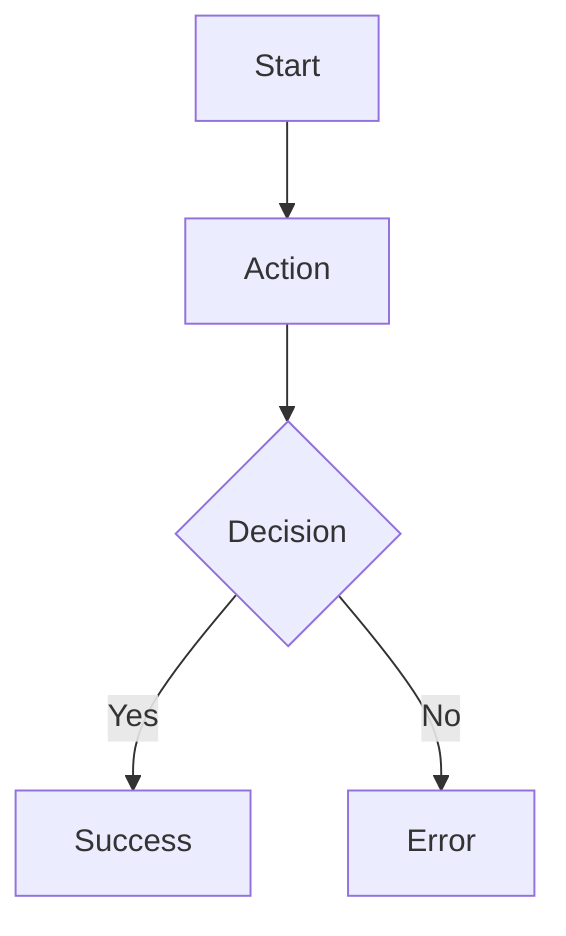

# Ticket Builder

## Purpose
Turn a raw product request into a Jira-ready ticket that design, engineering, QA, and stakeholders can act on without a back-and-forth. Reduce ambiguity, surface missing pieces (analytics, edge cases, permissions, mobile), and adapt to the company's existing ticket format.

## When to use
- New feature tickets
- Improvement tickets for existing features
- Bug tickets
- Technical enablement / internal tooling tickets
- UX improvement tickets
- Analytics / event-tracking tickets
- A/B test implementation tickets
- Admin panel tickets
- Compliance-related tickets
- Edge case handling tickets
- Follow-up tickets from a PRD
- Breaking a large epic into smaller tickets

## Context to gather (before questions)
Search whatever Jira/Confluence MCP tools are available for related material. Look for:

**Jira:**
- Similar existing tickets in the same product area
- Open and recently closed tickets touching the same flow
- Bugs connected to the same feature
- Existing epics and their child tickets
- Components, labels, squads, and owners
- The team's typical user-story format
- The team's typical Definition of Done structure
- QA notes and previous edge cases on related tickets
- Recurring or reopened tickets in this area

**Confluence:**
- PRDs related to the feature
- Technical documentation and product flow docs
- Design decision documents
- Known product constraints
- Product terminology and glossary
- Analytics tracking plans

Classify everything found as **Facts** (with source link), **Assumptions** (clearly marked), or **Missing** (called out). If no MCP tools are connected, skip silently and proceed.

## Guided questions
Ask one at a time. Use this exact format:

> **Question N:** <question>
> A. <option>
> B. <option>
> C. <option>
> D. Other: write your own

**Question 1:** What type of ticket is this?
A. New feature
B. Improvement to an existing feature
C. Bug or issue
D. Other: write your own

**Question 2:** Who is the main user affected?
A. End user
B. Admin / internal user
C. Support / operations team
D. Other: write your own

**Question 3:** What is the main goal of this ticket?
A. Improve user experience
B. Fix a problem or reduce friction
C. Support a business or operational need
D. Other: write your own

**Question 4:** Is this connected to an existing flow or feature?
A. Yes, it changes an existing flow
B. Yes, it adds something to an existing feature
C. No, it is a new flow or capability
D. Other: write your own

## Output
Produce the following structure exactly (markdown), adapted to the company's existing ticket format if Jira context reveals a different convention:

```markdown
# [Ticket Title]

## User Story
As a [user type], I want to [action], so that [value].

## Background / Context
[Explain why this ticket is needed, citing Jira/Confluence sources when used.]

## Problem
[What problem are we solving?]

## Desired Outcome
[What should be true after this ticket is completed?]

## Scope
### In Scope
- [Item 1]
- [Item 2]

### Out of Scope
- [Item 1]
- [Item 2]

## User Flow
1. [Step 1]
2. [Step 2]
3. [Step 3]

## Visual User Flow


(Or, if a polished diagram is preferred, provide an image-generation prompt instead.)

## Functional Requirements
- [Requirement 1]
- [Requirement 2]

## Edge Cases
- [Edge case 1]
- [Edge case 2]

## Analytics / Tracking
- Event name:
- Trigger:
- Properties:
- Success metric:

## Dependencies
- Design:
- Backend:
- Frontend:
- Data:
- Legal / Compliance:
- Other:

## Definition of Done
- [DoD item 1]
- [DoD item 2]

## Open Questions
- [Question 1]
- [Question 2]
```

## Quality rules
- Be specific, not generic
- Use company terminology found in scanned context
- Separate facts (cite source) from assumptions (mark clearly)
- Call out missing information explicitly
- Suggest a better ticket title if the input is vague
- If the request is too large, suggest splitting into multiple tickets under an epic
- Detect missing analytics, error states, permissions, mobile/responsive, admin/internal behavior
- Output must be copy-pasteable into Jira (markdown)

## Advanced behaviors (apply when relevant)
- Suggest a sharper ticket title
- Detect a too-large request and propose a child-ticket breakdown
- Suggest QA scenarios
- Surface product risks and dependencies
- Recommend whether design, backend, or frontend work is required
- Reclassify the request (e.g., "this is actually a bug, not a feature")
- Offer both a Mermaid diagram and an image-generation prompt for the flow
